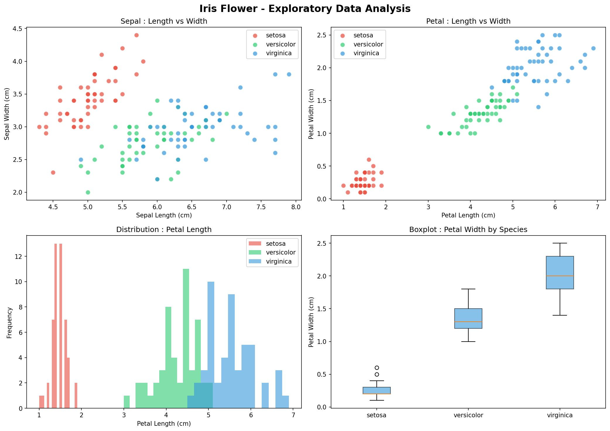
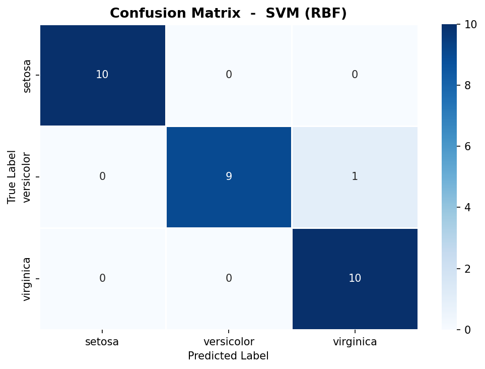
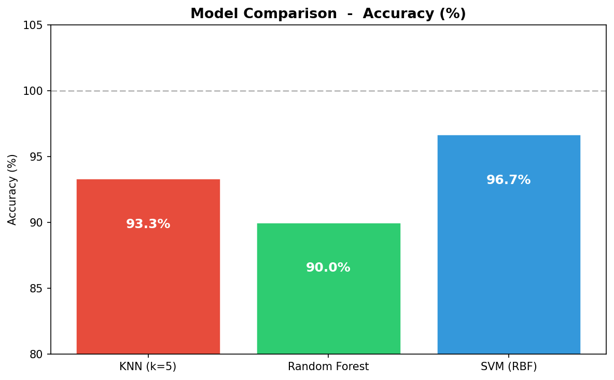

# Classification des fleurs Iris

**Stage Data Science CodeAlpha — Tâche 1**
Stagiaire : Moussa Guindo | ID : CA/DF1/100834 | Juin 2026

---

## Présentation

Ce projet entraîne et compare plusieurs modèles de machine learning pour classifier automatiquement les espèces de fleurs Iris à partir de leurs mesures (longueur et largeur des sépales et pétales). Le modèle le plus performant est sélectionné automatiquement et sauvegardé pour une utilisation ultérieure.

**Espèces cibles :** Iris Setosa, Iris Versicolor, Iris Virginica

---

## Structure du projet

```
CodeAlpha_IrisClassification/
│
├── iris_classification.py      # Script principal
├── iris_best_model.pkl         # Meilleur modèle sauvegardé
├── iris_scaler.pkl             # StandardScaler sauvegardé
├── iris_exploration.png        # Graphiques d'exploration des données
├── iris_confusion_matrix.png   # Matrice de confusion du meilleur modèle
├── iris_model_comparison.png   # Comparaison des performances
└── README.md
```

---

## Technologies

| Outil | Usage |
|---|---|
| Python 3.13.9 | Langage principal |
| Pandas / NumPy | Manipulation des données |
| Scikit-learn | Modèles, prétraitement, évaluation |
| Matplotlib / Seaborn | Visualisation |
| Joblib | Sauvegarde du modèle |

---

## Dataset

| Propriété | Valeur |
|---|---|
| Nombre d'échantillons | 150 (50 par espèce) |
| Nombre de features | 4 |
| Valeurs manquantes | Aucune |
| Découpage | 120 entrainement / 30 test |

**Statistiques descriptives :**

| Feature | Moyenne | Ecart-type | Min | Max |
|---|---|---|---|---|
| Sepal length (cm) | 5.84 | 0.83 | 4.30 | 7.90 |
| Sepal width (cm) | 3.06 | 0.44 | 2.00 | 4.40 |
| Petal length (cm) | 3.76 | 1.77 | 1.00 | 6.90 |
| Petal width (cm) | 1.20 | 0.76 | 0.10 | 2.50 |

---

## Modèles entraînés

| Modèle | Configuration |
|---|---|
| K-Nearest Neighbors | k = 5 |
| Random Forest | 100 estimateurs, random_state = 42 |
| Support Vector Machine | Noyau RBF, C = 1.0 |

---

## Résultats

| Modèle | Accuracy | Precision | Recall | F1-score |
|---|---|---|---|---|
| KNN (k=5) | 93.33% | 0.94 | 0.93 | 0.93 |
| Random Forest | 90.00% | 0.90 | 0.90 | 0.90 |
| SVM (RBF) | **96.67%** | **0.97** | **0.97** | **0.97** |

Le meilleur modèle est le **SVM (RBF)** avec une accuracy de **96.67%** sur les données de test.
Il est sauvegardé automatiquement sous `iris_best_model.pkl`.

**Exemple de prédiction :**

```
Entrée  : sepal_length=5.1, sepal_width=3.5, petal_length=1.4, petal_width=0.2
Sortie  : SETOSA
```

---

## Lancer le projet

```bash
# Cloner le dépôt
git clone https://github.com/VOTRE_USERNAME/CodeAlpha_IrisClassification.git
cd CodeAlpha_IrisClassification

# Installer les dépendances
pip install numpy pandas matplotlib seaborn scikit-learn joblib

# Exécuter le script
python iris_classification.py
```

---

## Visualisations

### Exploration des données


### Matrice de confusion


### Comparaison des modèles


---

## Auteur

**Moussa Guindo**
Stagiaire Data Science — CodeAlpha
ID : CA/DF1/100834